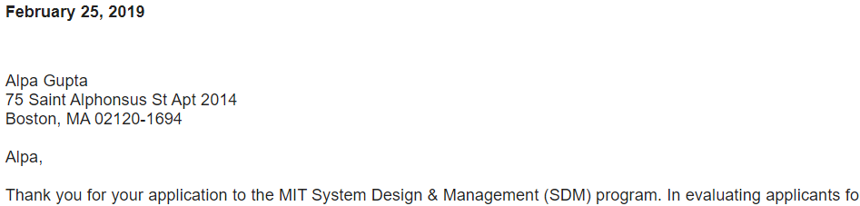

## Engineering Project Management 

The project displays knowledge awareness of project costs, impacts of delays, revenue implications and various checksteps involved in a new product development process. For details please click on executable in https://github.com/alpaddesai/NewProductDevelopmentProcesses/releases  Company confidential information is not displayed. All images are either custom by Alpa D Desai or reference name is included. 

 

Details: https://github.com/alpaddesai/ProgramManagement, https://github.com/alpaddesai/FinanceForEngineers, https://github.com/alpaddesai/SystemsEngineering, https://github.com/alpaddesai/PowerandInfluentialSkills and https://github.com/alpaddesai/CreatingandLeadingEffectiveOrganizations.

## Engineering Project Manager (EPM)

### Software Engineering
Software Engineering Product Development : https://github.com/alpaddesai/SoftwareEngineering2022
### Hardware Engineering
Hardware Engineering Product Development : https://github.com/alpaddesai/ArchitecturalDesign2022
 

## Application

## Ethics and Excellence

