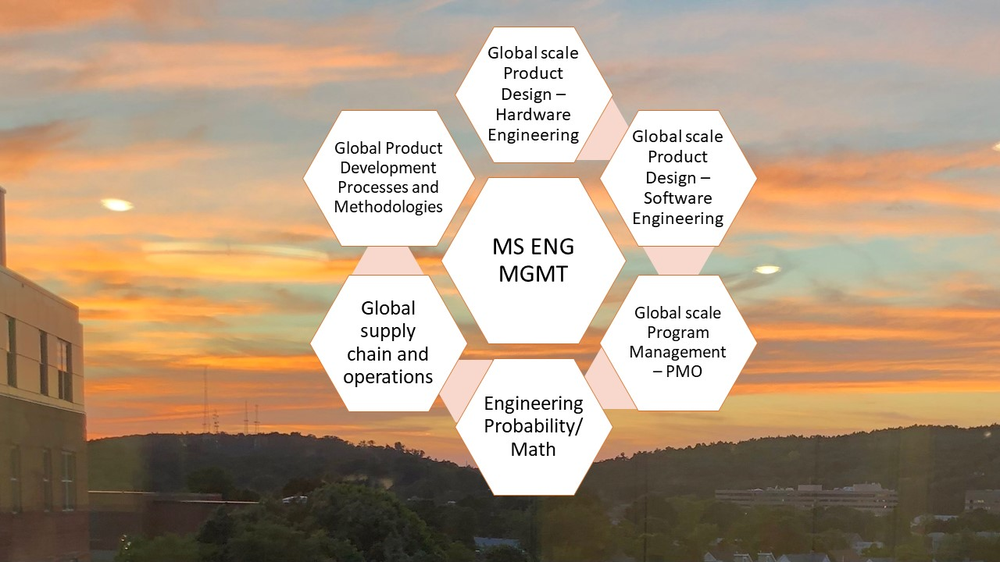

## Engineering Project Management 

The project displays knowledge awareness of project costs, impacts of delays, revenue implications and various checksteps involved in a new product development process. Company confidential information is not displayed. All images are either custom by Alpa D Desai or reference name is included. 

 

### MS ENG MGT
Details: https://github.com/alpaddesai/ProgramManagement, https://github.com/alpaddesai/EconomicDecisionMaking, https://github.com/alpaddesai/PowerandInfluentialSkills, https://github.com/alpaddesai/BusinessNegotiations, https://github.com/alpaddesai/CreatingandLeadingEffectiveOrganizations, https://github.com/alpaddesai/ProductDevelopmentProcesses, https://github.com/alpaddesai/OperationsResearch, https://github.com/alpaddesai/ProbabilityStatistics, https://github.com/alpaddesai/DataVisualizationIS  and https://github.com/alpaddesai/GraduateDegrees.

## Engineering Project Manager (EPM)

### Software Engineering
Software Engineering Product Development : https://github.com/alpaddesai/SoftwareEngineering
### Hardware Engineering
Hardware Engineering Product Development : https://github.com/alpaddesai/DesignEngineering
 
#### Popular Vote: https://github.com/alpaddesai/ProjectManagementInstituteCertification

## Application

## Ethics and Excellence

Additional details reference https://github.com/alpaddesai/GraduateDegrees
