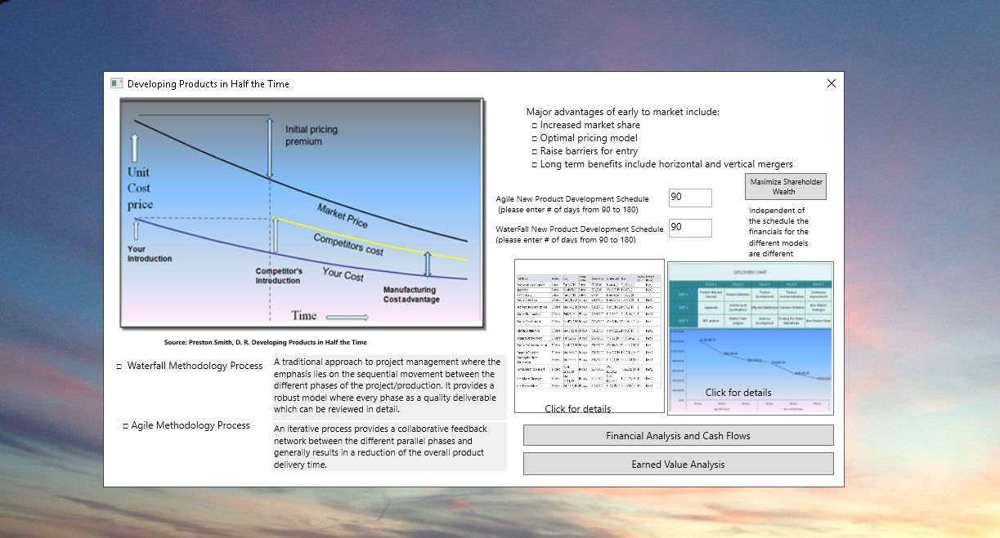
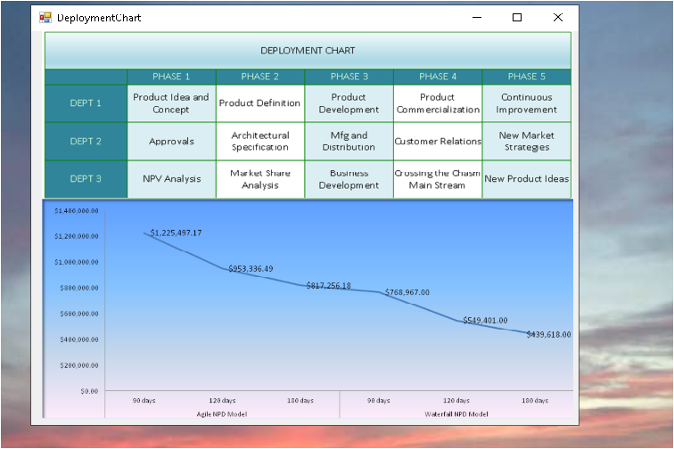
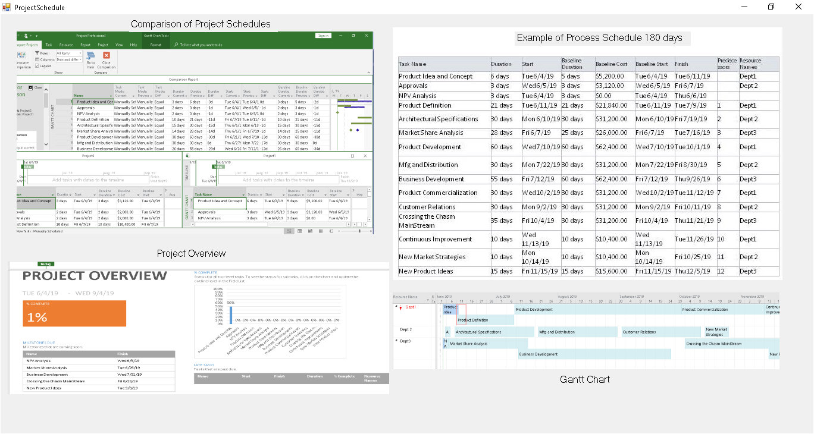
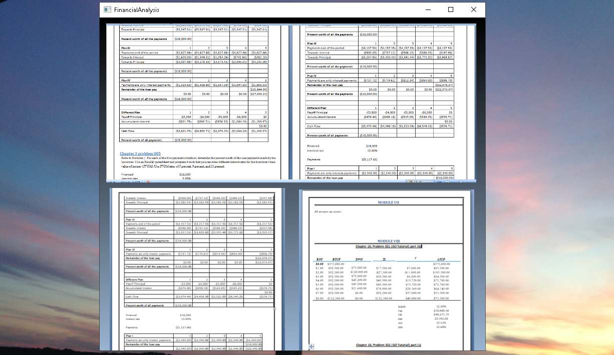
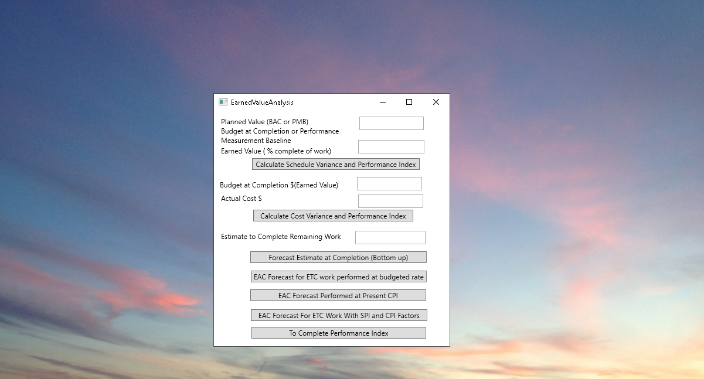
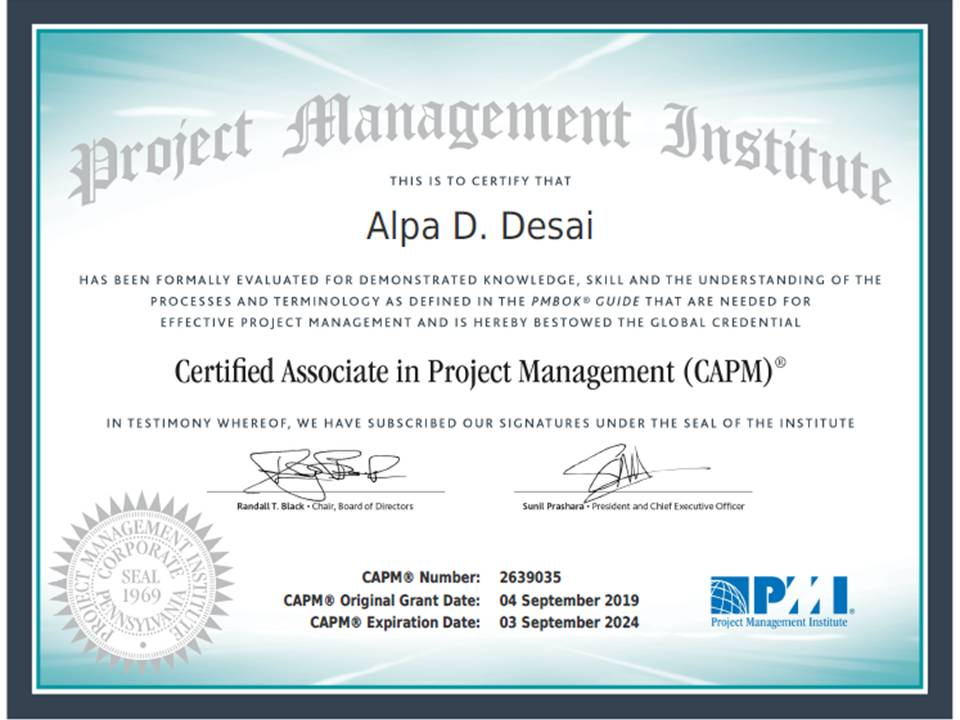

## New Product Development Process

The project displays knowledge awareness of project costs, impacts of delays, revenue implications and various checksteps involved in a new product development process. For details please click on executable in https://github.com/alpaddesai/NewProductDevelopmentProcesses/releases  Company confidential information is not displayed. All images are either custom by Alpa D Desai or reference name is included. 

 

 

### Using MS project

Further details: https://github.com/alpaddesai/TechnicalProjectManagement and https://github.com/alpaddesai/EconomicDecisionMaking.

## Engineering Project Management (EPM)

### Software Engineering
Software Engineering Product Development : https://github.com/alpaddesai/SoftwareEngineering
### Hardware Engineering
Hardware Engineering Product Development : https://github.com/alpaddesai/HardwareEngineeringLab4-

